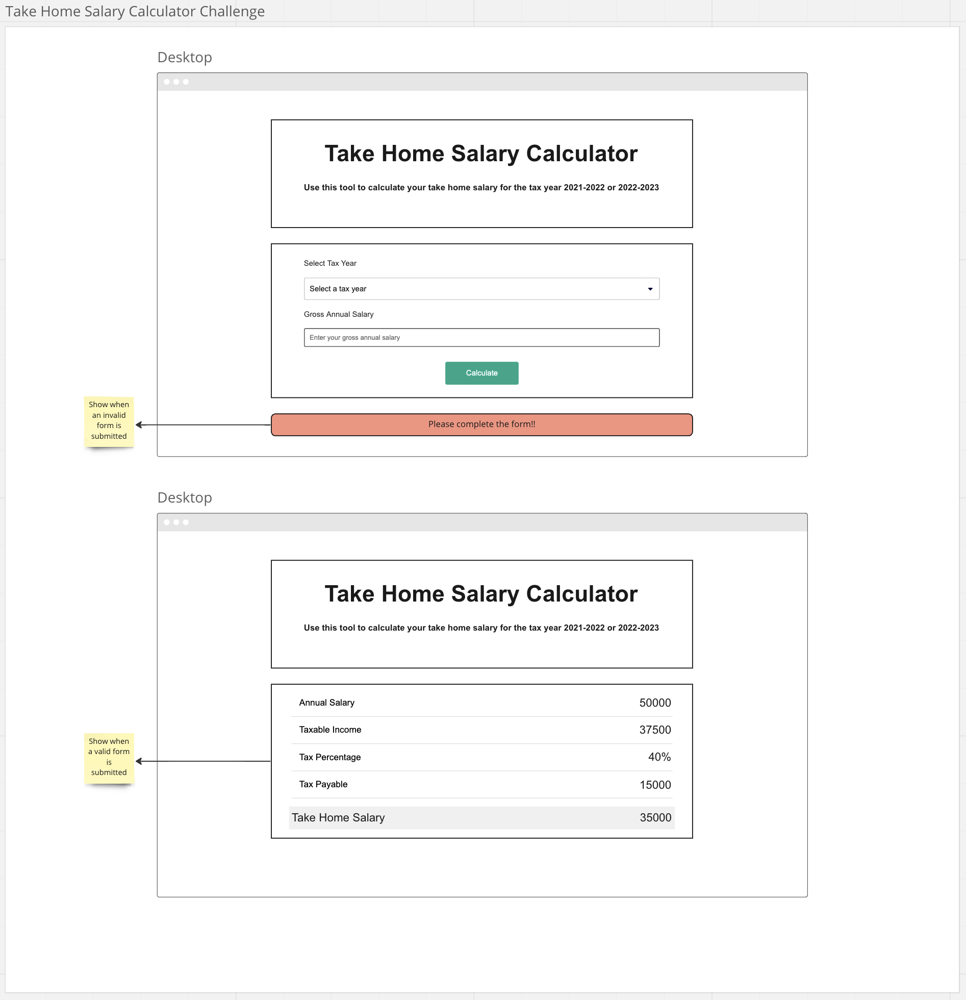
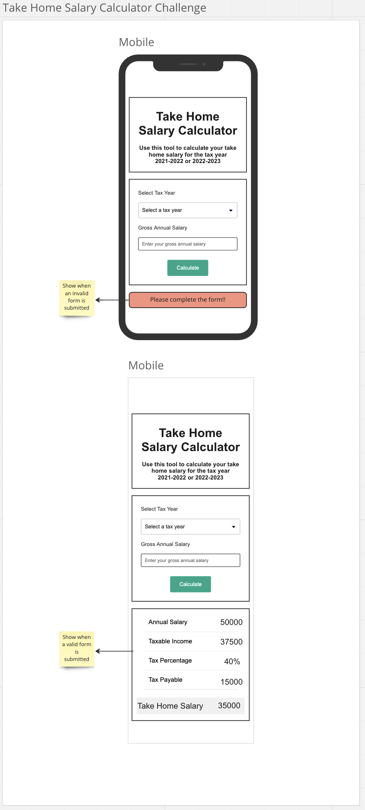

# Take Home Salary Calculator

## User Story

As a user I should be able to determine my take home salary after income tax deduction for the year tax 2021/2022 and also my new income tax deduction for the year 2022/2023 taking in to account the national personal allowance of £12,500.

| Annual Salary      | 21/22 Tax % | 22/23 Tax % |
| ------------------ | ----------- | ----------- |
| £12,501 - £40,000  | 20%         | 18%         |
| £40,001 - £100,000 | 40%         | 35%         |
| above £100,000     | 45%         | 40%         |

**Example for 2021/2022**

> Annual income: £50,000

> Taxable income: £50,000 - £12,500 = £37,500

> Tax %: 40%

> Tax: 40% of £37,500 = £15,000

> Take home salary: £50,000 - £15,000 = **£35,000**

**Example for 2022/2023**

> Annual income: £50,000

> Taxable income: £50,000 - £12,500 = £37,500

> Tax %: 35%

> Tax: 35% of £37,500 = £13,125

> Take home salary: £50,000 - £13,125 = **£36,875**

## Acceptance Criteria

> Must select a valid tax year from the dropdown: 2021/2022 or 2022/2023

> Must enter their gross salary as a valid number

> When the user clicks on the "Calculate" button then the results must be displayed in a card with the following information: Annual Salary, Taxable Income, Tax Percentage, Tax Payable, Take Home Salary

> When the user clicks on the "Calculate" button without a valid gross salary then an error message must be displayed "Please complete the form!!"

## Design Guide





## Getting Started

1. > Navigate to your `coding_bootcamp` workspace:

```
cd ~/coding_bootcamp
```

2. > Create a react project using the `create-react-app` script and use your own app name:

```
npx create-react-app your-app-name
cd your-react-app
```

3. > Create a repository in [GitHub](https://github.com/new) and enter the "Repository name" as the same name as your react app.

4. > In the terminal within your react app enter the commands provided by GitHub. The first command points your local repository to the remote GitHub, the second command sets your branch as `main` and the last command pushes all your local changes to the remote repository

```
git remote add origin git@github.com:YOUR_GITHUB_USERNAME/your-app-name.git
git branch -M main
git push -u origin main
```

5. > Once you refresh your GitHub page on the web browser you will see all your local files in GitHub.

6. > You can now proceed to work locally and add commit and push code regularly during development

## Resources

- CSS framework: [Bootstrap 5](https://getbootstrap.com/docs/5.3/getting-started/introduction/)
- Colour palette: [coolors](https://coolors.co/)
- Icons: [font-awesome icons](https://fontawesome.com/icons) | [CDN](https://cdnjs.com/libraries/font-awesome)
- [React docs](https://beta.reactjs.org/)
